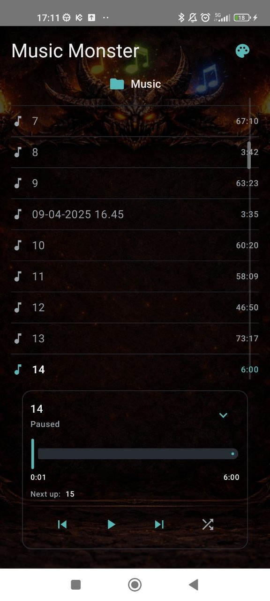
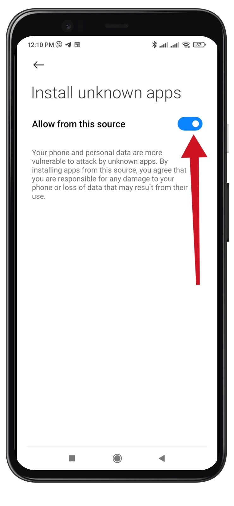

# 🎵 Music Monster

An **ad-free, offline music player for Android**. Play the audio files on your device,
organize playlists, shape the sound, and make the player look your way.

**Android 7.0 or newer · No account required · No Internet permission**

<p align="center">
  
</p>

<p align="center"><sub>Player preview from an earlier release.</sub></p>

## ⬇️ Download & install

Check **[Releases](https://github.com/NomeSame/MusicBox/releases)** for published APKs.
If no APK is available yet, you can build the app from source using the instructions below.

1. Download the release `.apk` to your Android device.
2. Open it from your browser's downloads or your file manager.
3. If Android asks, allow **Install unknown apps** for that browser or file manager.
   The location and wording of this setting vary by device.
4. Tap **Install**, then open **Music Monster**.
5. Allow audio access to load your device library, or use the **Music** folder picker
   to select a specific folder. Allow notifications if you want notification controls.

<details>
<summary>Example: allowing installation from your browser or file manager</summary>

<p align="center">
  
</p>

</details>

Keep [Google Play Protect](https://support.google.com/android/answer/2812853?hl=en)
enabled. Review any warning before installing; a warning is not proof that an APK is safe.

## ✨ Features

- **Your music, locally:** load the device audio library or a chosen folder, including subfolders.
  Common formats include MP3, M4A, FLAC, OGG, and WAV; decoding support depends on your device.
- **Natural sorting and fast scrolling:** numbered titles sort naturally, with a draggable
  scrollbar and letter indicator for larger libraries.
- **Background playback:** play/pause, previous/next, seeking, shuffle, repeating playback,
  and notification/lock-screen controls. The player remembers the last track and position.
- **Playlists:** create playlists, add or remove songs, start from a selected song,
  and import/export playlists as JSON. Playlist exports contain references to songs, not audio files.
- **Equalizer and bass boost:** adjust the available bands and choose Metal, Rock, Classic,
  Flat, or Pop presets. Audio effects and band availability depend on the device.
- **Sleep timer:** 15-, 30-, and 60-minute presets, a custom hours/minutes/seconds duration,
  cancellation, and a gentle fade-out before playback pauses.
- **Make it yours:** accent colors, a custom image background, background dimming,
  player-card transparency, and an optional accent color extracted from your image.
- **Compact navigation:** pull down the song list to reveal the Playlists, Equalizer,
  and Sleep Timer panels, then swipe between them.

## 🔒 Privacy & permissions

Music Monster has **no Internet permission** and includes no advertising or analytics SDKs.
It does not require an account or upload your music library.

- Audio/storage access lets the app find local music. Choosing a folder grants access
  to that folder separately through Android's system picker.
- Notification access enables playback controls outside the app.
- Background playback and audio-effect permissions support playback and the equalizer.

Files and preferences are handled on the device. If you choose a cloud-backed folder or
file provider, that provider manages its own network access independently of Music Monster.

## 🔄 Updates

Check [Releases](https://github.com/NomeSame/MusicBox/releases) for newer APKs.
Install the update over the existing app to retain its settings and playlists.
The APK must use the same application ID and signing certificate, and Android must accept
its version. An incompatible signing certificate prevents an in-place update.

Export your playlists before uninstalling: uninstalling removes the app's local settings.

## 🛠️ Build from source

The repository is named **MusicBox**; the installed app is **Music Monster**
(`com.nomesame.musicmonster`). It uses Kotlin, Jetpack Compose, and AndroidX Media3.

1. Open the project in Android Studio with support for Android Gradle Plugin 8.13.2.
2. Install **Android SDK Platform 36** and configure its local SDK path.
3. Use **JDK 17 or newer**, compatible with the project's Gradle 8.13 wrapper.
   See the [Android Gradle Plugin compatibility requirements](https://developer.android.com/build/releases/agp-8-13-0-release-notes).
4. Run the following from the project root in PowerShell:

```powershell
.\gradlew.bat assembleDebug testDebugUnitTest
```

The debug APK is generated at `app/build/outputs/apk/debug/app-debug.apk`.

For device/emulator tests:

```powershell
.\gradlew.bat connectedDebugAndroidTest
```

Release builds use local signing configuration when provided; otherwise they are unsigned.
Signing keys and machine-specific configuration are not included in the repository.

## ✅ Development status

Latest local validation: **5 October 2026**.

- **445 local unit/Robolectric test executions passed**, with no failures or skipped tests.
- Debug and release builds, the Android test APK, and lint checks completed successfully.
- **42 instrumented tests are compiled; the current device test run remains pending.**
  No device or emulator was connected for the latest validation. Compatibility testing
  is intended to cover API 24, API 30, and API 35/36.

Recent fixes improve playlist imports and ID allocation, folder permissions, library
scanning, Unicode title sorting, playback-session cleanup, image decoding bounds,
and sleep-timer behavior.

## 💬 Feedback

Bug reports and feedback are welcome in
[Issues](https://github.com/NomeSame/MusicBox/issues).
Please include your app version, Android version, device model, and steps to reproduce.
For playback problems, include the audio format and whether the file came from the device
library or a selected folder.
